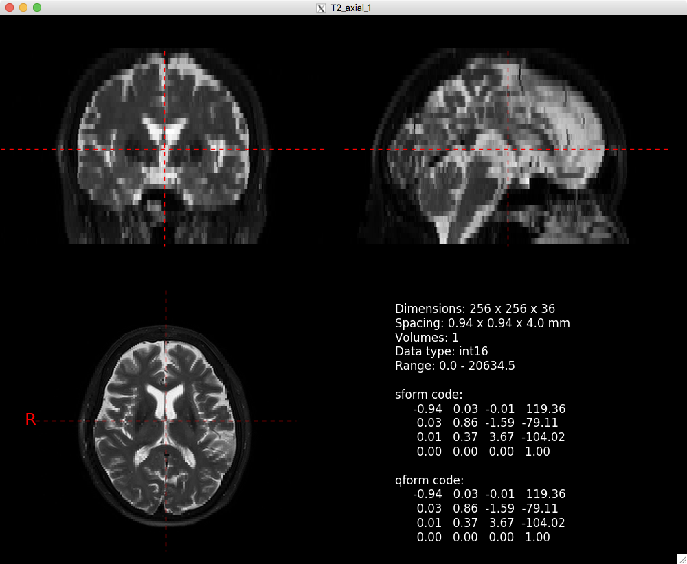

# niipre: A quick preview tool for nifti files #

niipre was developed as a tool to quickly generate an overview of a nifti image and its header information. It is modeled after the Diffusion Tensor Imaging Toolkit quiclook plugin for OSX. 

niipre is a single Python 3 script file that uses nibabel, numpy, and matplotlib to create an overview with the mid-sagittal, mid-coronal, and mid-axial slices. A fourth pane in the figure displays information on voxel size, number of volumes, the affine matrix, and some other parameters. niipre uses X11 to display the figure. 

niipre works with nifti files and gzipped nifti files. To use niipre, add the script to your path and run it with your image as first and only input parameter.

`niipre.py myNiftiImage.nii.gz`

Example output:

niipre has been tested on OSX 10.12.6 and Debian 9.1 (stretch).
